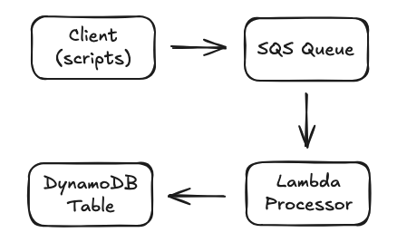

# System Architecture

## Overview

The Distributed Task Queue System is a serverless, event-driven architecture built on AWS. It processes asynchronous tasks with automatic scaling, error handling, and status tracking.

## Architecture Diagram



## Component Details

### 1. Client Layer (Python Scripts)
- **Purpose**: Submit tasks and check status
- **Components**:
  - `submit_task.py`: Sends tasks to SQS queue
  - `check_task_status.py`: Queries task status from DynamoDB
- **Communication**: Uses AWS SDK (boto3) with IAM authentication

### 2. Message Queue (Amazon SQS)
- **Purpose**: Reliable message delivery and decoupling
- **Configuration**:
  - Standard queue (not FIFO) for better throughput
  - Visibility timeout: 300 seconds (5 minutes)
  - Message retention: 4 days (default)
- **Features**:
  - At-least-once delivery guarantee
  - Automatic retry with exponential backoff
  - Dead Letter Queue for failed messages (future enhancement)

### 3. Task Processor (AWS Lambda)
- **Purpose**: Process tasks automatically when they arrive
- **Configuration**:
  - Runtime: Python 3.11
  - Memory: 128 MB (configurable based on task needs)
  - Timeout: 300 seconds (5 minutes)
  - Concurrent executions: 1000 (default)
- **Trigger**: SQS event source mapping
  - Batch size: 10 messages
  - Automatic deletion on successful processing

### 4. Status Storage (Amazon DynamoDB)
- **Purpose**: Track task status and results
- **Schema**:
  - Partition key: `taskId` (String)
  - Attributes:
    - `status`: PROCESSING | COMPLETED | FAILED
    - `updatedAt`: ISO 8601 timestamp
    - `timestamp`: Unix timestamp for sorting
    - `result`: Task processing result (JSON)
    - `error`: Error message if failed
- **Capacity**: On-demand pricing mode for automatic scaling

## Task Flow

### 1. Task Submission
```
Client → SQS.SendMessage → Message in Queue
```
- Client generates unique task ID
- Message includes: task_id, type, data, priority
- SQS returns message ID for tracking

### 2. Task Processing
```
SQS → Lambda Trigger → Process Task → Update DynamoDB
```
- Lambda polls SQS automatically
- Receives up to 10 messages per batch
- Updates status to PROCESSING
- Executes task based on type
- Updates status to COMPLETED/FAILED
- Deletes message from queue on success

### 3. Status Check
```
Client → DynamoDB.GetItem → Return Status
```
- Query by task ID
- Returns current status and results
- No impact on processing flow

## Task Types

### IMAGE_RESIZE
- **Input**: Image filename
- **Processing**: Simulated resize operation
- **Output**: Resize confirmation and dimensions

### SEND_EMAIL
- **Input**: Recipient email address
- **Processing**: Simulated email sending
- **Output**: Send confirmation and message ID

### PROCESS_DATA
- **Input**: Data object with record count
- **Processing**: Simulated data transformation
- **Output**: Processing confirmation and record count

## Scalability Considerations

### Current Design
- **Throughput**: ~1000 concurrent Lambda executions
- **Message processing**: 10 messages per Lambda invocation
- **Storage**: DynamoDB scales automatically

### Bottlenecks
1. **Lambda concurrency limit**: Default 1000 (can be increased)
2. **SQS throughput**: Virtually unlimited for standard queues
3. **DynamoDB write capacity**: Auto-scales with on-demand mode

### Future Scaling Options
1. **Reserved concurrency**: Guarantee Lambda capacity
2. **FIFO queues**: For ordered processing (reduced throughput)
3. **Multiple queues**: Separate by priority or task type
4. **Cross-region replication**: For global distribution

## Error Handling

### Current Implementation
- **Lambda retry**: Automatic 2 retries on failure
- **Error tracking**: Failed status in DynamoDB with error message
- **Visibility timeout**: Prevents duplicate processing

### Future Enhancements
1. **Dead Letter Queue**: For permanently failed messages
2. **Exponential backoff**: Custom retry delays
3. **Circuit breaker**: Prevent cascading failures
4. **Alerting**: CloudWatch alarms for high failure rates

## Security

### IAM Permissions
- **Lambda execution role**:
  - SQS: ReceiveMessage, DeleteMessage
  - DynamoDB: PutItem
  - CloudWatch Logs: CreateLogGroup, PutLogEvents

### Data Protection
- **Encryption at rest**: 
  - SQS: AWS managed keys
  - DynamoDB: AWS managed keys
- **Access control**: IAM policies with least privilege

## Monitoring and Observability

### CloudWatch Metrics
- **SQS Metrics**:
  - ApproximateNumberOfMessages
  - ApproximateAgeOfOldestMessage
  - NumberOfMessagesSent/Received/Deleted

- **Lambda Metrics**:
  - Invocations
  - Duration
  - Errors
  - Throttles

- **DynamoDB Metrics**:
  - ConsumedReadCapacityUnits
  - ConsumedWriteCapacityUnits
  - UserErrors

### Logging
- **Lambda logs**: CloudWatch Logs
  - Task processing details
  - Error stack traces
  - Performance metrics